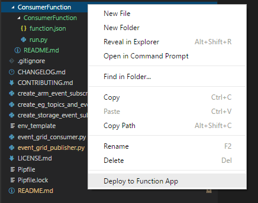

# Python Azure Function for Event Grid

You can directly deploy this folder using VSCode, by installing the [Azure Function extension for VSCode](https://aka.ms/vscode-azure-functions).

Then you can deploy your app by just doing a right click and "Deploy to Function App":

This will create a Function called "ConsumerFunction" available at the url: https://<your-web-app-account>.azurewebsites.net/api/ConsumerFunction